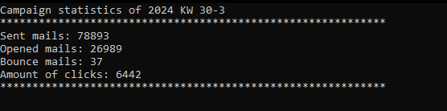
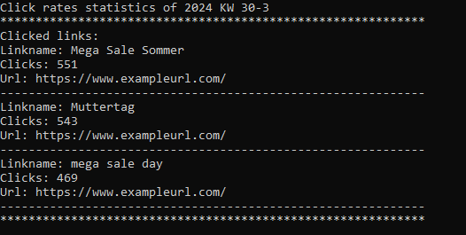
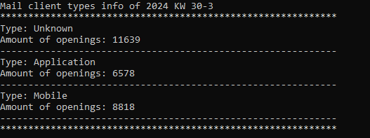

# Read campaign statistic data

## Preparation

Set the campaign id of the campaign you want to read statistic data of in the [Example_ReadCampaignStatistics](Example_ReadCampaignStatistic.cs) class.

## Steps

1. Read statistic data

## 1. Read statistic data

After the campaign is sent, display the campaign statistic data.

According to the campaign you should get something like this:

Create requests to call the API methods you want to to use. Then process the data as you need.